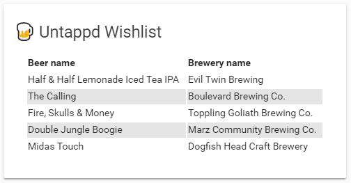

# Beer Wishlist Card

This card give you a list of your wishlist items with this [custom sensor](https://github.com/custom-components/sensor.untapped).\
This card is based of the [tracker-card](https://github.com/custom-cards/tracker-card) by [@ciotlosm](https://github.com/ciotlosm).

## Options

| Name | Type | Requirement | Description
| ---- | ---- | ------- | -----------
| type | string | **Required** | `custom:beer-wishlist-card`
| entity | string | **Required** | The entity_id of the entity you want to show.
| title | string | **Optional** | Add a custom title to the card.

## Installation

### Step 1

Install `beer-wishlist-card` by copying `beer-wishlist-card.js`from this repo to `<config directory>/www/beer-wishlist-card.js` on your Home Assistant instanse.

**Example:**

```bash
wget https://raw.githubusercontent.com/custom-cards/beer-wishlist-card/master/beer-wishlist-card.js
mv beer-wishlist-card.js /config/www/
```

### Step 2

Link `beer-wishlist-card` inside you `ui-lovelace.yaml`.

```yaml
resources:
  - url: /local/beer-wishlist-card.js?v=0
    type: js
```

### Step 3

Add a custom element in your `ui-lovelace.yaml`

```yaml
      - type: custom:beer-wishlist-card
        entity: sensor.my_sensor
```


